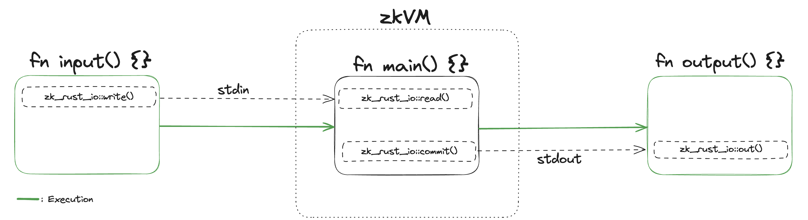

# prooflab-rs

prooflab-rs is a CLI tool that simplifies developing zero-knowledge applications in Rust using zkVMs like SP1 or Risc0.

## Project Structure

The project is organized as a Cargo workspace with the following crates:

- `crates/prooflab`: Core CLI tool and zkVM integration
- `crates/prooflab_io`: I/O marshalling between host and guest programs
- `crates/zk_rust_io`: Alternative I/O interface for guest programs

It abstracts away the complexity of zkVM integration while giving developers the choice of which zkVM backend to use for their applications.

For performance benchmarks and detailed reports on each supported zkVM, visit [prooflab.dev](https://prooflab.dev) - our benchmark platform that helps you compare and select the right zkVM for your specific needs.

## Installation

### Prerequisites

- [Rust](https://www.rust-lang.org/tools/install) must be installed on your machine

### Option 1: Install from Release Binaries

```sh
curl -L https://raw.githubusercontent.com/ProofLabDev/prooflab-rs/main/install_prooflab.sh | bash
```

### Option 2: Install for Local Development

```sh
make install
```

### Option 3: Use Docker

prooflab-rs can also be run in a Docker container with all dependencies pre-configured.

#### Building the Docker Image

```sh
docker build -t prooflab-rs .
```

#### Running the Docker Container

Basic usage:
```sh
docker run -it prooflab-rs bash
```

For faster builds and better performance, mount your local Rust cache:
```sh
docker run -it \
  -v "$HOME/.cargo/registry:/root/.cargo/registry" \
  -v "$HOME/.cargo/git:/root/.cargo/git" \
  prooflab-rs bash
```

This significantly speeds up builds by reusing your local Rust package cache.

## Quickstart

### Creating a New Project

Create a workspace for your project:

```sh
cargo new <PROGRAM_DIRECTORY>
```

### Try the Examples

prooflab-rs comes with several example programs in the `examples` directory that demonstrate different use cases:

- **Fibonacci**: Computing and reading Fibonacci numbers
- **RSA**: Key verification
- **ECDSA**: Signature verification
- **JSON**: Verification of blockchain state diffs
- **SHA256**: Computing cryptographic hashes
- **Tendermint**: Block verification
- **ZK Quiz**: Interactive user quiz with zero-knowledge proofs

## Usage:

To use prooflab-rs, you must define a `main()` function that will be executed and proven within the zkVM. This function must be defined in a `main.rs` file with the following directory structure:

```
.
└── <PROGRAM_DIRECTORY>
    ├── Cargo.toml
    └── src
        └── main.rs
```

Projects can also include libraries in a separate `lib/` folder:

```
.
└── <PROGRAM_DIRECTORY>
    ├── Cargo.toml
    ├── lib/
    └── src
        └── main.rs
```

In addition to `main()`, you can define optional `input()` and `output()` functions:

- `input()`: Runs outside the zkVM before proof generation. Use this to prepare inputs for the VM, such as deserializing transactions or fetching external data.
- `main()`: Runs inside the zkVM. This is the code that will be proven.
- `output()`: Runs outside the zkVM after proof generation. Use this to process data produced by the VM.



### Data Flow Between Host and Guest

prooflab-rs provides a simple I/O API through the `prooflab_io` crate:

1. **Host → Guest**: Use `prooflab_io::write()` in your `input()` function to send data to the VM. Any type that implements [Serialize](https://docs.rs/serde/latest/serde/trait.Serialize.html) can be used.

2. **Inside Guest**: Use `prooflab_io::read()` in your `main()` function to receive input data. Use `prooflab_io::commit()` to send output data.

3. **Guest → Host**: Use `prooflab_io::out()` in your `output()` function to retrieve data committed by the guest.

The `prooflab_io` crate provides function declarations that act as compile-time symbols, allowing you to compile and test your code before running it in a zkVM.

### Adding prooflab_io to Your Project

Add the `prooflab_io` crate to your project by including the following in your `Cargo.toml`:

```toml
prooflab_io = { git = "https://github.com/ProofLabDev/prooflab-rs.git", package = "prooflab_io" }
```

### `input()`:

```rust
use prooflab_io;

pub fn input() {
    let pattern = "a+".to_string();
    let target_string = "an era of truth, not trust".to_string();

    // Write in a simple regex pattern.
    prooflab_io::write(&pattern);
    prooflab_io::write(&target_string);
}
```

### `main()`

```rust
use regex::Regex;
use prooflab_io;

pub fn main() {
    // Read two inputs from the prover: a regex pattern and a target string.
    let pattern: String = prooflab_io::read();
    let target_string: String = prooflab_io::read();

    // Try to compile the regex pattern. If it fails, write `false` as output and return.
    let regex = match Regex::new(&pattern) {
        Ok(regex) => regex,
        Err(_) => {
            panic!("Invalid regex pattern");
        }
    };

    // Perform the regex search on the target string.
    let result = regex.is_match(&target_string);

    // Write the result (true or false) to the output.
    prooflab_io::commit(&result);
}
```

### `output()`:

```rust
use prooflab_io;

pub fn output() {
    // Read the output.
    let res: bool = prooflab_io::out();
    println!("res: {}", res);
}
```

### Generating Proofs

To generate a proof of your code's execution, run one of the following commands:

- **Using SP1**:
  ```sh
  cargo run --release -- prove-sp1 <PROGRAM_DIRECTORY_PATH>
  ```

- **Using Risc0**:
  ```sh
  cargo run --release -- prove-risc0 <PROGRAM_DIRECTORY_PATH>
  ```

  > **Note:** Aligned currently supports verification of [Risc0](https://dev.risczero.com/api/zkvm/quickstart#1-install-the-risc-zero-toolchain) proofs from release version `v1.0.1`. 

### Submitting Proofs to Aligned

To submit proofs to [Aligned](https://github.com/yetanotherco/aligned_layer), follow these steps:

1. Generate a local wallet keystore using [cast](https://book.getfoundry.sh/cast/):
   ```sh
   cast wallet new-mnemonic
   ```

2. Import your created keystore:
   ```sh
   cast wallet import --interactive <PATH_TO_KEYSTORE.json>
   ```

3. Generate and submit your proof using the `--submit-to-aligned` flag:
   ```sh
   cargo run --release -- prove-sp1 <PROGRAM_DIRECTORY_PATH> --submit-to-aligned --keystore-path <PATH_TO_KEYSTORE>
   ```

### Command-line Options

| Flag | Description | Default |
|------|-------------|---------|
| `--submit-to-aligned` | Sends the proof to Aligned for verification after generation. Requires RPC URL and keystore. | |
| `--keystore-path` | Path to your wallet keystore. | `~/keystore` |
| `--rpc-url` | Ethereum RPC URL for submitting proofs. | `https://ethereum-holesky-rpc.publicnode.com` |
| `--network` | Chain ID of the Ethereum network where Aligned is deployed. | `holesky` |
| `--precompiles` | Enables hardware acceleration for specific cryptographic operations. | |

#### Precompile Acceleration

When the `--precompiles` flag is used, the following operations are accelerated:

**SP1 Accelerated Crates:**
- sha2 v0.10.6
- sha3 v0.10.8
- crypto-bigint v0.5.5
- tiny-keccak v2.0.2
- ed25519-consensus v2.1.0
- ecdsa-core v0.16.9

**Risc0 Accelerated Crates:**
- sha2 v0.10.6
- k256 v0.13.1
- crypto-bigint v0.5.5

> **Note:** For precompiles to work, your project must use the exact crate versions listed above.

## Support

For help with prooflab-rs or questions about implementation, please join our [Telegram support group](https://t.me/+7Qd3EutBDwZhM2U5).

## Examples

After installing prooflab-rs, run any of the following example commands. You can choose either Risc0 or SP1 as your zkVM backend:

| Example | Risc0 | SP1 |
|---------|-------|-----|
| **Fibonacci** | `make prove_risc0_fibonacci` | `make prove_sp1_fibonacci` |
| **RSA** | `make prove_risc0_rsa` | `make prove_sp1_rsa` |
| **ECDSA** | `make prove_risc0_ecdsa` | `make prove_sp1_ecdsa` |
| **Blockchain State Diff** | `make prove_risc0_json` | `make prove_sp1_json` |
| **Regex** | `make prove_risc0_regex` | `make prove_sp1_regex` |
| **SHA256** | `make prove_risc0_sha` | `make prove_sp1_sha` |
| **Tendermint** | `make prove_risc0_tendermint` | `make prove_sp1_tendermint` |
| **ZK Quiz** | `make prove_risc0_zkquiz` | `make prove_sp1_zkquiz` |

## Acknowledgments

prooflab-rs is designed to simplify development of programs using zkVMs and reduce code duplication for developers experimenting with zero-knowledge proofs on the Aligned layer.

We thank the [SP1](https://github.com/succinctlabs/sp1.git) and [Risc0](https://github.com/risc0/risc0.git) teams for their contributions to the field of Zero Knowledge Cryptography and for building the powerful zkVM technologies that prooflab-rs supports.
